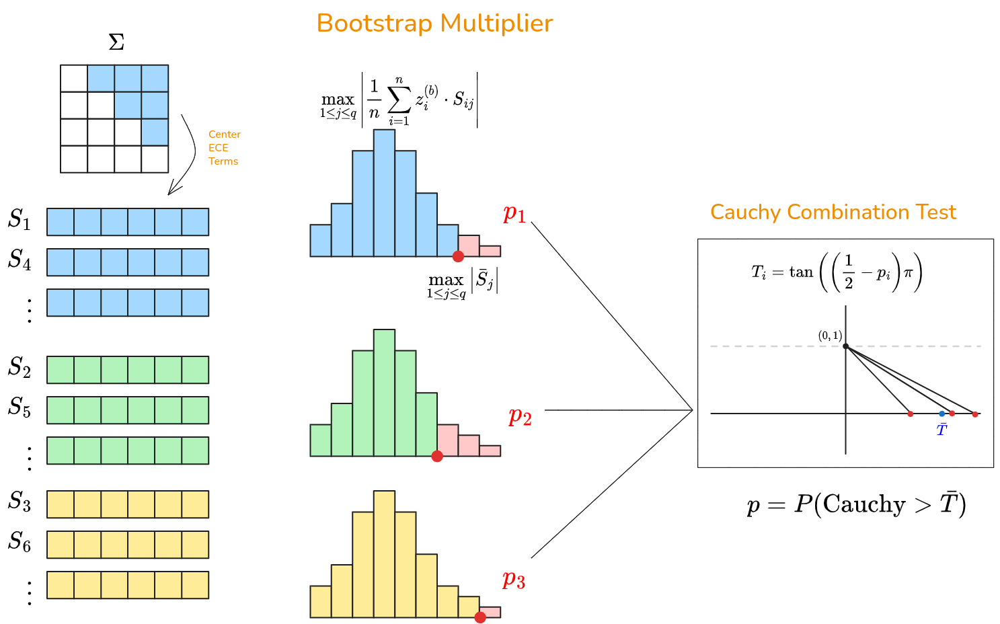

```{R}
#| echo: false
#| message: false
devtools::load_all()
```



We test the hypotheses
$$H_0: \Sigma = I_p \quad \text{vs} \quad H_1: \Sigma \neq I_p.$$
Equivalently, this is a test of whether all off-diagonal entries $\sigma_{xy} = 0$, which are precisely the quantities estimated by the ECE.

**Outline.** The Multiplier Bootstrap provides a distribution-free null distribution for a sum of mean-zero independent terms. The ECE satisfies neither condition directly: its summands are neither mean-zero nor independent. We address each in turn. First, we reparametrize the ECE as a sum of terms $s_i^{(k)}$ that are mean-zero under $H_0$. Second, we partition these terms into three subsequences, each comprising independent terms. Each subsequence yields a p-value via the Multiplier Bootstrap. Finally, since the three subsequences are mutually dependent, we combine their p-values using the Cauchy Combination Test.

## Notation

Using circular indexing $i := [(i-1) \bmod n] + 1$, define the $k$-lagged sum
$$T_k(X, Y) = \sum_{i=1}^n (X_i - X_{i+k})(Y_i - Y_{i+k}).$$

For notational convenience, define $s_i^{(k)} = (X_i - X_{i+k})(Y_i - Y_{i+k})$, so that 
$$T_k(X,Y) = \sum_{i=1}^n s_i^{(k)}.$$

## Multiplier Bootstrap

The Multiplier Bootstrap requires each summand to be mean-zero. The terms $s_i^{(k)}$ do not satisfy this directly.

**Making Terms Mean Zero.**

Under circular indexing, shifting all indices by 1 leaves $T_1$ unchanged:
$$T_1(X,Y) = \sum_{i=1}^n s_i^{(1)} = \sum_{i=1}^n s_{i+1}^{(1)}.$$
Therefore $2T_1(X,Y) = \sum_{i=1}^n \left(s_i^{(1)} + s_{i+1}^{(1)}\right)$, and the ECE estimator becomes
$$\hat\sigma_{xy} = \frac{2T_1(X,Y) - T_2(X,Y)}{2n} = \frac{1}{n}\sum_{i=1}^n \underbrace{\frac{s_i^{(1)} + s_{i+1}^{(1)} - s_i^{(2)}}{2}}_{S_i} = \bar{S}.$$

::: {.callout-note collapse="true"}
## Proof: $S_i$ is mean-zero under $H_0$

Define $h_i^{(k)} = (\theta_{x,i} - \theta_{x,i+k})(\theta_{y,i} - \theta_{y,i+k})$ and $e_i^{(k)} = (\varepsilon_{x,i} - \varepsilon_{x,i+k})(\varepsilon_{y,i} - \varepsilon_{y,i+k})$. Since cross terms have mean zero, $\mathbb{E}[s_i^{(k)}] = h_i^{(k)} + 2\sigma_{xy}$. Therefore
$$\mathbb{E}[S_i] = \tfrac{1}{2}\bigl(h_i^{(1)} + h_{i+1}^{(1)} - h_i^{(2)}\bigr) + \sigma_{xy}.$$
Under $H_0$ ($\sigma_{xy} = 0$), it remains to show $h_i^{(1)} + h_{i+1}^{(1)} - h_i^{(2)} = 0$. We consider two cases.

If there is a change point at $i$: minimum segment length 2 forces $\theta_{i+1} = \theta_{i+2}$, so $h_{i+1}^{(1)} = 0$ and $h_i^{(2)} = h_i^{(1)}$. Hence $h_i^{(1)} + 0 - h_i^{(1)} = 0$.

If there is a change point at $i+1$: then $\theta_i = \theta_{i+1}$, so $h_i^{(1)} = 0$ and $h_i^{(2)} = h_{i+1}^{(1)}$. Hence $0 + h_{i+1}^{(1)} - h_{i+1}^{(1)} = 0$.

If there is no change point at either index, all terms are zero. Hence $\mathbb{E}[S_i] = 0$ under $H_0$.
:::

::: {.callout-note collapse="true"}
## Code: $S_i$ is mean-zero under $H_0$

```{R}
config <- scenario(2, n=1000, L=2)
means <- replicate(1000, {
  X <- generate_data(config)
  mean(ece_terms(X))
})
hist(means, breaks=40, xlab=expression(bar(S)))
abline(v=0, col="red", lty=2)
t.test(means)$conf.int
```
:::

**Making Terms Independent.**

Each $S_i$ depends only on observations $X_i, X_{i+1}, X_{i+2}$ (and the same for $Y$), so $S_i$ and $S_j$ are independent whenever $|i - j| \geq 3$. This motivates partitioning by residue mod 3:
$$\{S_1, S_4, S_7, \ldots\}, \quad \{S_2, S_5, S_8, \ldots\}, \quad \{S_3, S_6, S_9, \ldots\}.$$
Within each subsequence, consecutive terms are at least 3 apart, so the terms are independent. However, the three subsequences share observations and are mutually dependent, so their p-values cannot be combined trivially.

::: {.callout-note collapse="true"}
## Code: All Subsequences are Independent
```{R}
config <- scenario(2, n=1000, L=2)
pval <- replicate(1000, {
  X <- generate_data(config)
  d <- ece_terms(X)
  splits <- split_indep(d)
  map_dbl(splits, \(s) Box.test(s, lag=10, type="Ljung-Box")$p.value)
}) |> t()

colMeans(pval < 0.05)
```

```{R}
#| echo: false
par(mfrow = c(1, 3))
hist(pval[, 1], xlab="p-value", main=paste("Subsequence", 1), breaks=10, freq=FALSE)
abline(h=1, col="red")
hist(pval[, 2], xlab="p-value", main=paste("Subsequence", 2), breaks=10, freq=FALSE)
abline(h=1, col="red")
hist(pval[, 3], xlab="p-value", main=paste("Subsequence", 3), breaks=10, freq=FALSE)
abline(h=1, col="red")
par(mfrow = c(1, 1))
```
:::

## Cauchy Combination Test

Given p-values $p_1, p_2, p_3$ from the three subsequences, the CCT statistic is
$$T = \sum_{j=1}^3 w_j \tan\!\left(\left(\tfrac{1}{2} - p_j\right)\pi\right),$$
where $w_j > 0$ are weights with $\sum_j w_j = 1$, typically $w_j = 1/3$. Under $H_0$, each $p_j$ is uniformly distributed on $[0,1]$, so each summand is standard Cauchy. The key property of the CCT is that $T$ is approximately standard Cauchy under $H_0$ regardless of the dependence structure among the $p_j$. The combined p-value is the upper-tail probability $p = 1 - F_{\mathrm{Cauchy}}(T)$, where $F_{\mathrm{Cauchy}}(t) = \frac{1}{2} + \frac{\arctan(t)}{\pi}$ is the standard Cauchy CDF. Substituting,
$$p = 1 - \frac{1}{2} - \frac{\arctan(T)}{\pi} = \frac{1}{2} - \frac{\arctan(T)}{\pi}.$$

::: {.callout-note collapse="true"}
## Code: Combined P-value is Uniform Under $H_0$
```{R}
#| cache: true 
config <- scenario(2, n=1000, L=2)
pvals <- replicate(1000, {
  X <- generate_data(config)
  ece.test(X, type="bs.multiplier", B=500)$p.value
})
hist(pvals, breaks=10, xlab="p-value", main="", freq=FALSE)
abline(h=1, col="red")
mean(pvals < 0.05)  # ~0.05
```
:::
