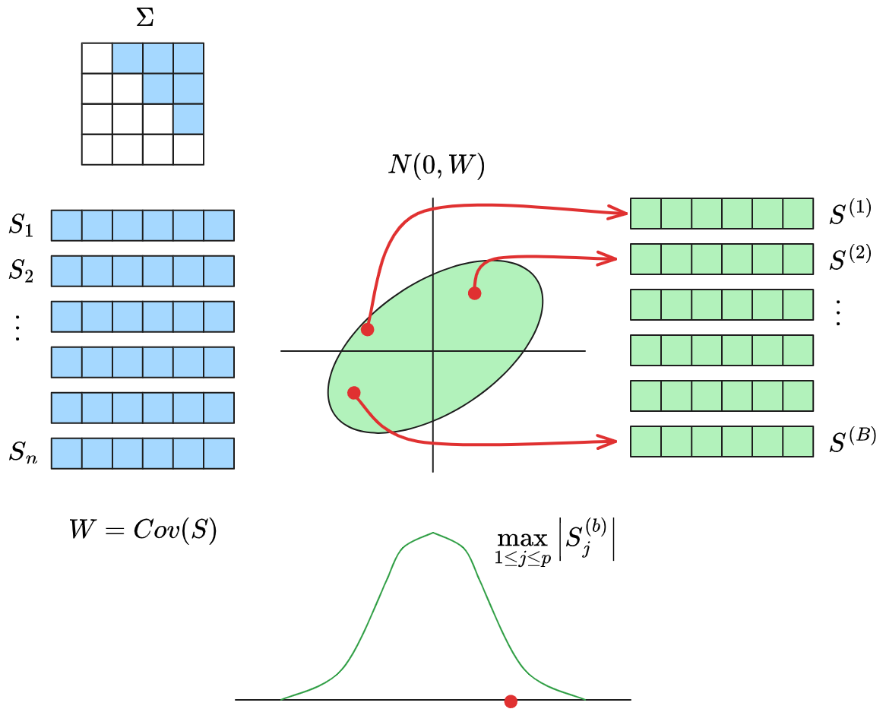

```{R}
#| echo: false
#| message: false
devtools::load_all()
```



## Parametric Bootstrap Test

Let $S_i \in \mathbb{R}^p$ denote the vector of lag terms across all pairs at index $i$. To test $H_0$, we need the variance of $\bar{S} = \frac{1}{n}\sum_{i=1}^n S_i$.

Since $S_i$ depends only on observations at indices $i, i+1, i+2$, terms separated by 3 or more indices are independent. The variance therefore has bandwidth 2:
\begin{align*}
\operatorname{Var}\!\left(\bar{S}\right) &= \frac{1}{n^2}\left(\sum_{i=1}^n \operatorname{Var}(S_i) + \sum_{i=1}^n\bigl[\operatorname{Cov}(S_i, S_{i+1}) + \operatorname{Cov}(S_{i+1}, S_i)\bigr]\right. \\
&\quad\left. + \sum_{i=1}^n\bigl[\operatorname{Cov}(S_i, S_{i+2}) + \operatorname{Cov}(S_{i+2}, S_i)\bigr]\right).
\end{align*}
Plugging in $\operatorname{Var}(S_i) = \mathbb{E}[S_i S_i^\top]$ and $\operatorname{Cov}(S_i, S_{i+k}) = \mathbb{E}[S_i S_{i+k}^\top]$ and estimating by sample quantities gives
$$V := \widehat{\operatorname{Var}}\!\left(\bar{S}\right) = \frac{1}{n^2}\left(\sum_{i=1}^n S_i S_i^\top + \sum_{i=1}^{n}\!\left(S_i S_{i+1}^\top + S_{i+1} S_i^\top\right) + \sum_{i=1}^{n}\!\left(S_i S_{i+2}^\top + S_{i+2} S_i^\top\right)\right).$$

**Parametric Bootstrap Test.** Under $H_0$, $\bar{S} \approx N(0, V)$ by the CLT. This gives a direct procedure:

1. Compute the observed statistic $T_\text{obs} = \max_{1 \leq j \leq p} |\bar{S}_j|$.
2. Draw $S^{(b)} \sim N(0, V)$ for $b = 1, \ldots, B$.
3. Compute $T^{(b)} = \max_{1 \leq j \leq p} |S^{(b)}_j|$.
4. The p-value is $\frac{1}{B}\sum_{b=1}^B \mathbf{1}\!\left[T^{(b)} \geq T_\text{obs}\right]$.

::: {.callout-note collapse="true"}
## Code: Parametric Bootstrap P-values are Uniform Under $H_0$
```{R}
#| cache: true
config <- scenario(2, n = 1000, L = 2)
pvals <- replicate(1000, {
  X <- generate_data(config)
  ece.test(X, type = "bs.parametric", B = 1000)$p.value
})
hist(pvals, breaks = 20, freq = FALSE,
     xlab = "p-value", main = "Null distribution of parametric bootstrap p-values")
abline(h = 1, col = "red", lty = 2)
mean(pvals < 0.1)
```
:::

**Consistency of $V$.** The parametric bootstrap is valid only if $V$ consistently estimates $\operatorname{Var}(\bar{S})$. If $V$ is systematically too small, the bootstrap null distribution will be too narrow, producing an excess of small p-values. We check this by simulating many datasets under $H_0$, computing the empirical variance of $\bar{S}$ across replications, and comparing it to the average of the estimated $V$. The two should agree.

::: {.callout-note collapse="true"}
## Code: Consistency of $V$
```{R}
#| cache: true
config <- scenario(2, n = 1000, L = 2)

sims <- map(1:1000, ~ {
  X <- generate_data(config)
  n <- nrow(X)
  S <- lag_terms(X)
  list(
    S_bar = colMeans(S),
    W     = as.numeric(
      (1 / n^2) * (
        t(S) %*% S +
        t(rotate(S)) %*% S + t(S) %*% rotate(S) +
        t(rotate(S, 2)) %*% S + t(S) %*% rotate(S, 2)
      )
    )
  )
})

S_bar_vals <- map_dbl(sims, "S_bar")
W_vals     <- map_dbl(sims, "W")

bs_draws <- rnorm(1000, 0, sqrt(mean(W_vals)))

xr <- range(c(S_bar_vals, bs_draws))
hist(S_bar_vals, breaks = 40, freq = FALSE, col = adjustcolor("red",  0.4),
     xlim = xr, xlab = expression(bar(S)), main = "")
hist(bs_draws,   breaks = 40, freq = FALSE, col = adjustcolor("blue", 0.4), add = TRUE)
abline(v = c(-1, 1) * sd(S_bar_vals),        col = "red",  lty = 2)
abline(v = c(-1, 1) * sqrt(mean(W_vals)),    col = "blue", lty = 2)
legend("topright",
       legend = c(expression("empirical "*bar(S)), expression("N(0, "*bar(V)*")")),
       fill = adjustcolor(c("red", "blue"), 0.4), border = NA)
```
:::

## Simulation Results

All simulations are run with exponential error terms in the setting with frequent mean shifts ($L = 4$). We see that in all cases, we are able to control type I error.

```{R}
#| echo: false
#| cache: true
params <- scenario(2, n=1000, p=2, L=4, r=0, err_type="exponential")
```

```{R}
#| echo: false
#| cache: true
set.seed(1)
pval_gaussian <- map_dbl(1:10000, ~{
  X <- generate_data(params)
  test.diag(X, method = "z.test.gaussian")$p.value
})
```

```{R}
#| echo: false
#| cache: true
set.seed(1)
pval_kappa <- map_dbl(1:10000, ~{
  X <- generate_data(params)
  test.diag(X, method = "z.test.kappa")$p.value
})
```

```{R}
#| echo: false
#| cache: true
set.seed(1)
pval_multiplier <- map_dbl(1:10000, ~{
  X <- generate_data(params)
  test.diag(X, method = "bs.multiplier")$p.value
})
```

```{R}
#| echo: false
#| cache: true
set.seed(1)
pval_parametric <- map_dbl(1:10000, ~{
  X <- generate_data(params)
  test.diag(X, method = "bs.parametric")$p.value
})
```

```{R}
#| echo: false
#| fig-width: 12
#| fig-height: 10
par(mfrow = c(2, 2))
hist(pval_gaussian,   breaks=10, freq=FALSE, main="Z-Test (Gaussian)",   xlab="p-value"); abline(h=1, col="red", lty="dashed")
hist(pval_kappa,      breaks=10, freq=FALSE, main="Z-Test (Kappa)",      xlab="p-value"); abline(h=1, col="red", lty="dashed")
hist(pval_multiplier, breaks=10, freq=FALSE, main="Bootstrap Multiplier", xlab="p-value"); abline(h=1, col="red", lty="dashed")
hist(pval_parametric, breaks=10, freq=FALSE, main="Parametric Bootstrap", xlab="p-value"); abline(h=1, col="red", lty="dashed")
par(mfrow = c(1, 1))
```

## Questions
- What happens if we have a NA value in the matrix?
